# EMR Serverless

## Table of contents

- [What's included](#whats-included)
- [Set Up Work](#set-up)
- [Main Tutorial](#main-tutorial)
- [Useful Links](#useful-links)
- [Creators](#creators)
- [Thanks](#thanks)

## What's included

The repo is to supplement the youtube video (link) on emr severless. 
The contents of the repo are denoted below. 

```text
folder1/
└── folder2/
    ├── folder3/
    │   ├── file1
    │   └── file2
    └── folder4/
        ├── file3
        └── file4
```

## Set up

1. Create EMR Notebook Role
- Open IAM and create the IAM role for the EMR notebook using FILE
- Attach AmazonElasticMapReduceEditorsRole policy
- Attached AmazonS3FullAccess policy 

2. Create EMR Servlerless Execution Role
- Open IAM and create the IAM role for the EMR Servlerless Execution using FILE
- Attach FILE policy for permisions

3. Create S3 bucket
- Open S3 console 
- create S3 bucket to use for the demo 

4. Create Folder To use in S3 Bucket 
- Create a `scripts` folder
- Create a `customers` folder (We use this to upload a CSV to)
- Create a `query-results` folder


## Main Tutorial

**Hive**
1. Naviagte to EMR home from the AWS Console and select EMR Studio from the left handside. 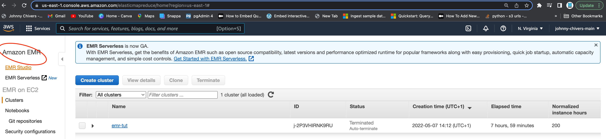

2. Select `Get Started` 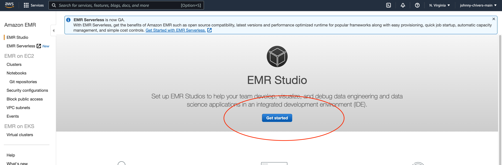

3. Select `Create Studio` 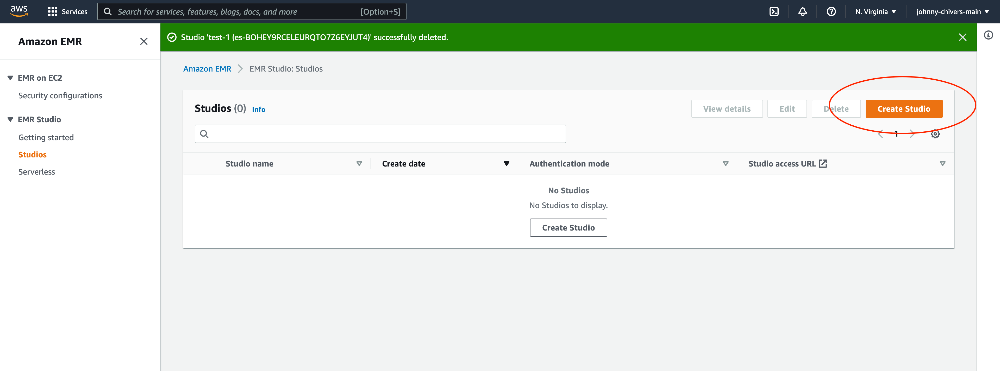

4. Insert Studio name 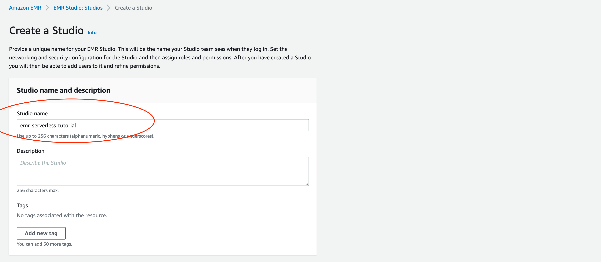

5. Under `Networking and Security` select your default VPC and 3 public subnets. 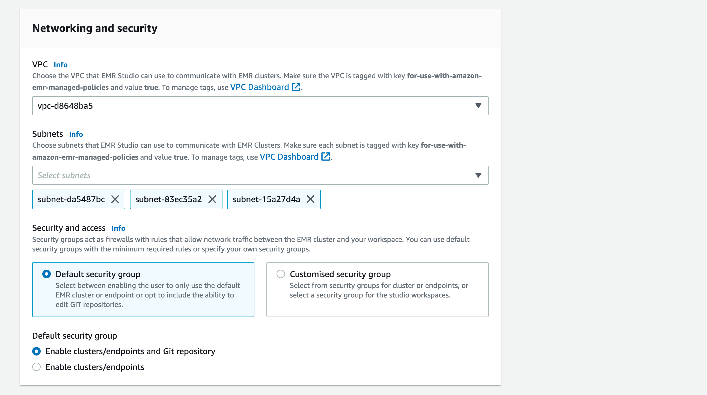

6. Select the EMR Studio role `emr-notebook-role-tutorial` created duing the [Set Up Work](#set-up) stage 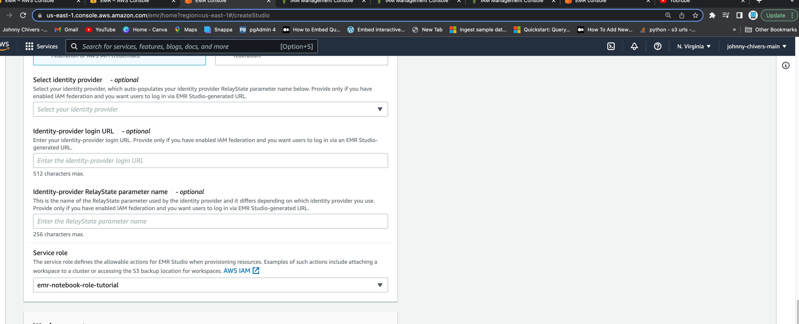

7. Select the S3 bucket created duing the [Set Up Work](#set-up) stage. (This will be your own customer bucket name) 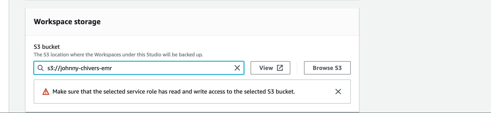

8. Select the `Studio access URL` 

9. Select `applications` under `serverless` from the left handside menu 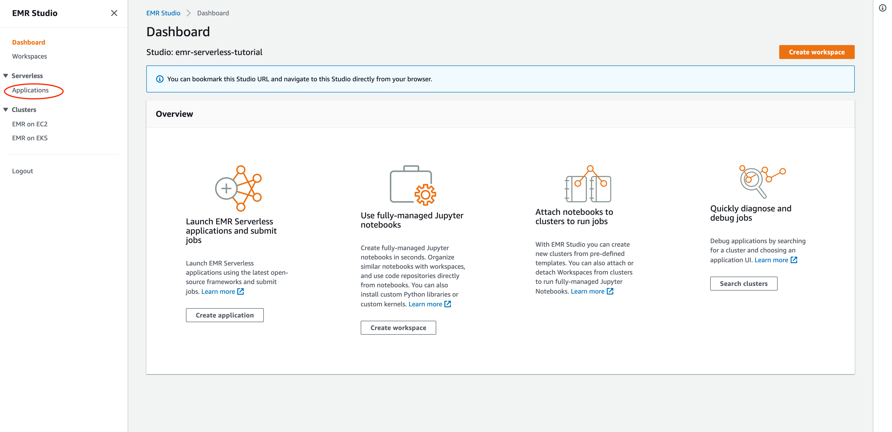

10 Select `create application` from the top right 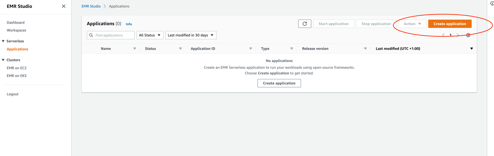

11. Enter a name for the application. Leave the type as `Spark` and click `create application` 

12. Click into the application via the `name` 

13. Click `submit job` 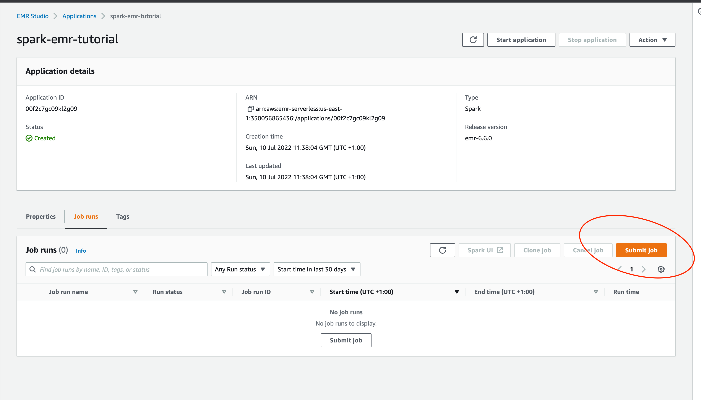

14. Name job and select the service role created in the set up steps. 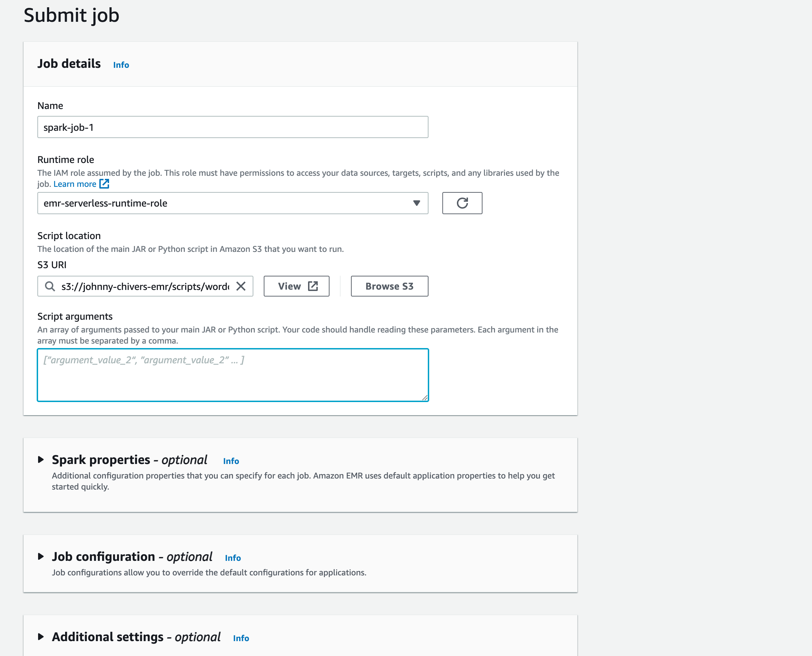

15. Click `Submit Job` 

16. job status will go from pending -> running -> success. 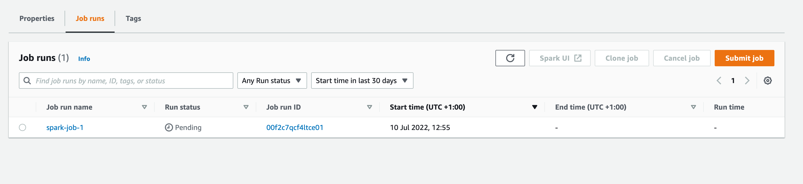


## Creators

**Johnny Chivers**

- <https://github.com/johnny-chivers/>

## Useful Links

- youtube video (link)
- website 
- buy me a coffee


Enjoy :metal:
