# EMR Serverless

## Table of contents

- [What's included](#whats-included)
- [Set Up Work](#set-up)
- [Main Tutorial](#main-tutorial)
- [Useful Links](#useful-links)
- [Creators](#creators)

## What's included

The repo is to supplement the youtube video (link) on emr severless.

## Set up

1. Create EMR Notebook Role
- Open IAM and create the IAM role for the EMR notebook using the [emr notebook role json](emr_notebook_rol_priv.json)
- Attach AmazonElasticMapReduceEditorsRole policy
- Attached AmazonS3FullAccess policy 

2. Create EMR Servlerless Execution Role
- Open IAM and create the IAM role for the EMR Servlerless Execution using [emr serverless role](emr_serverless_role_priv.json)
- Attach [policy for permisions](emr_serverless_policy.json)

3. Create S3 bucket
- Open S3 console 
- create S3 bucket to use for the demo 

4. Create Folder To use in S3 Bucket 
- Create a `scripts` folder
- Create a `customers` folder (We use this to upload a CSV to)
- Create a `query-results` folder

## Main Tutorial

**Studio Setup**
1. Naviagte to EMR home from the AWS Console and select EMR Studio from the left handside. 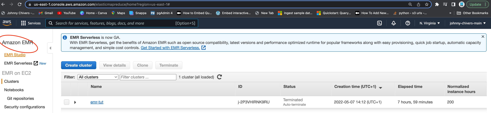

2. Select `Get Started` 

3. Select `Create Studio` 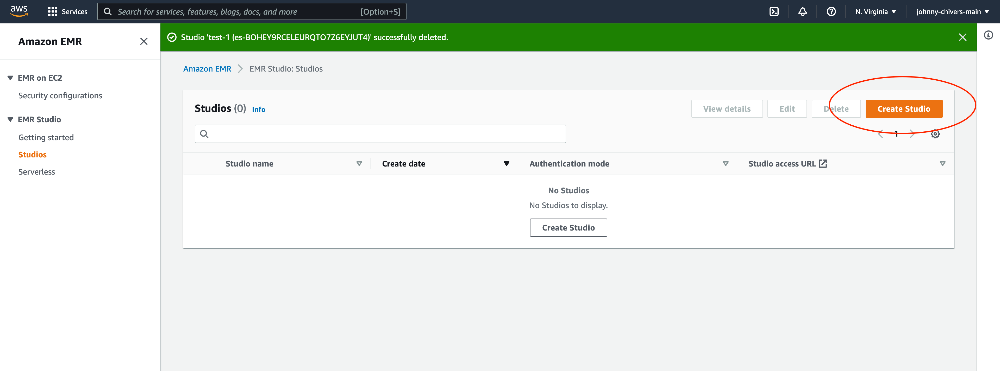

4. Insert Studio name 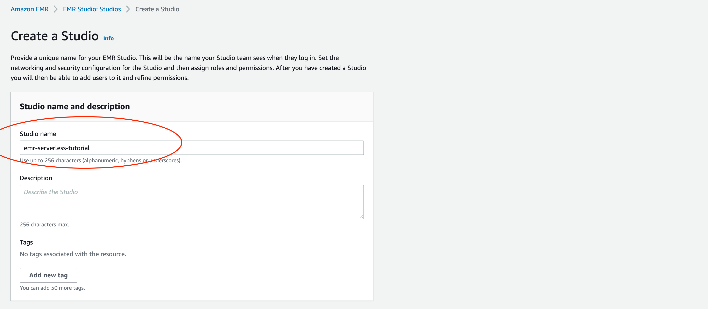

5. Under `Networking and Security` select your default VPC and 3 public subnets. 

6. Select the EMR Studio role `emr-notebook-role-tutorial` created duing the [Set Up Work](#set-up) stage 

7. Select the S3 bucket created duing the [Set Up Work](#set-up) stage. (This will be your own customer bucket name) 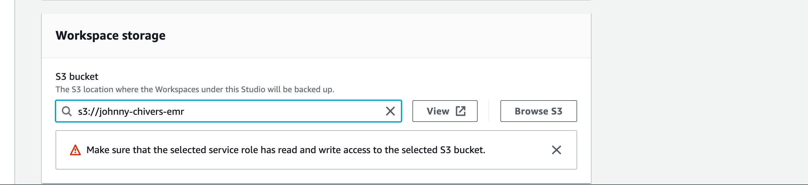

8. Select the `Studio access URL` 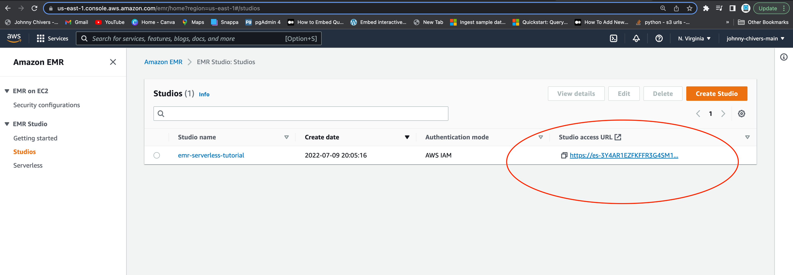

**Spark App Setup**

9. Select `applications` under `serverless` from the left handside menu 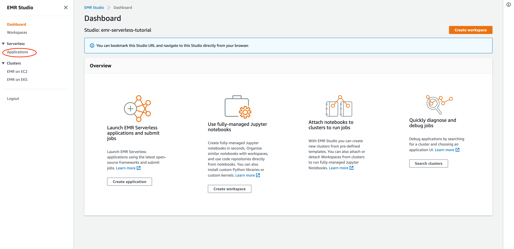

10 Select `create application` from the top right 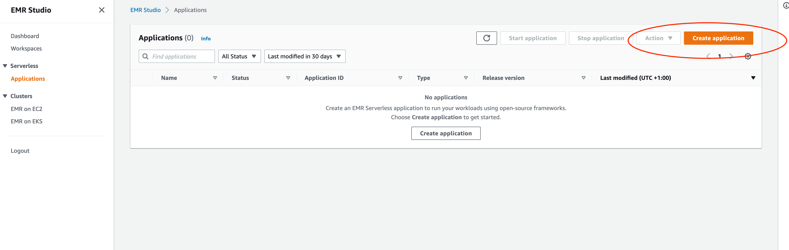

11. Enter a name for the application. Leave the type as `Spark` and click `create application` 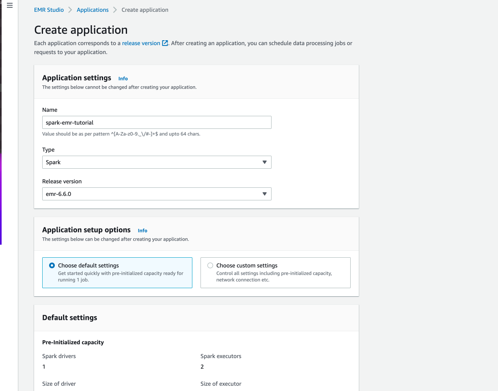

12. Click into the application via the `name` 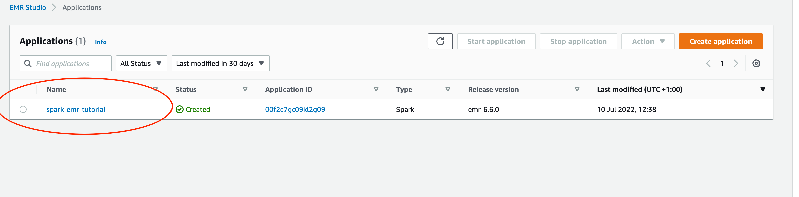

13. Click `submit job` 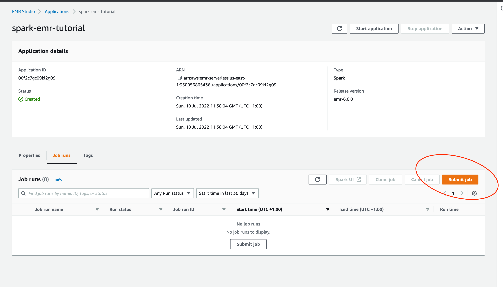

14. Name job and select the service role created in the set up steps. 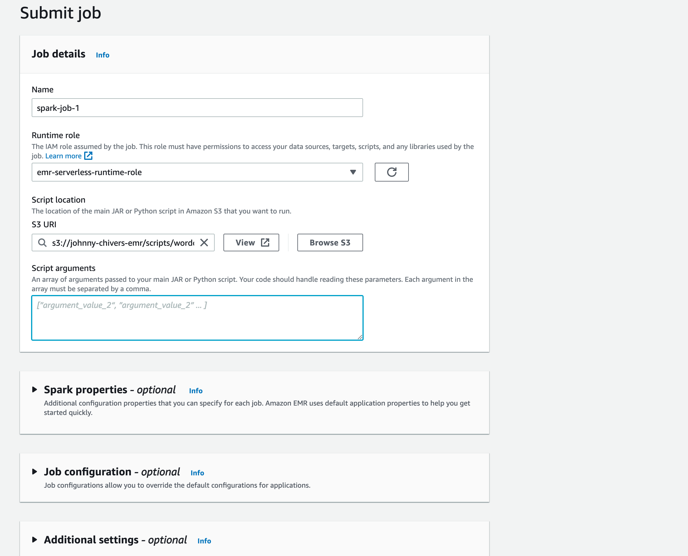

15. Click `Submit Job` 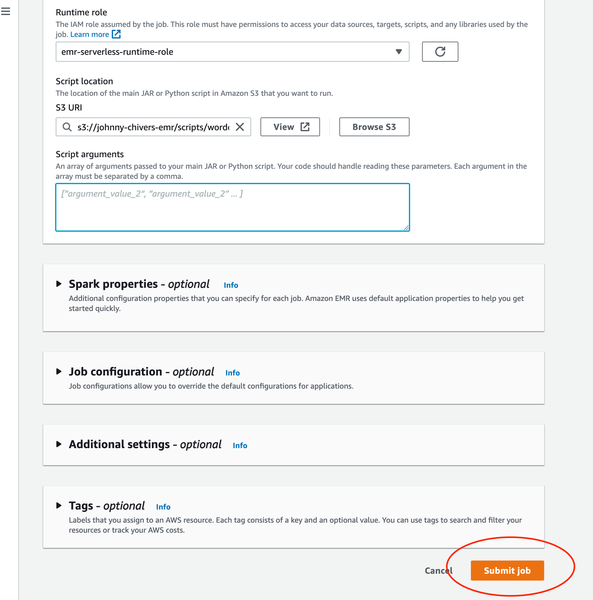

16. job status will go from pending -> running -> success. 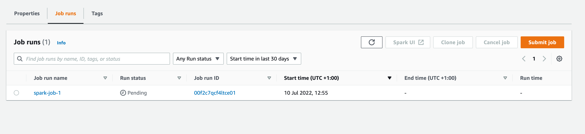

**Hive App Setup**

17. Create Application from applications 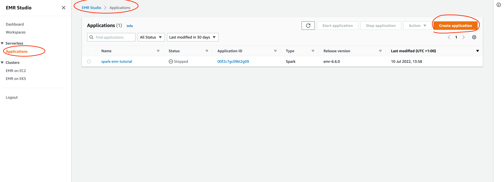

18. Name and select Hive application 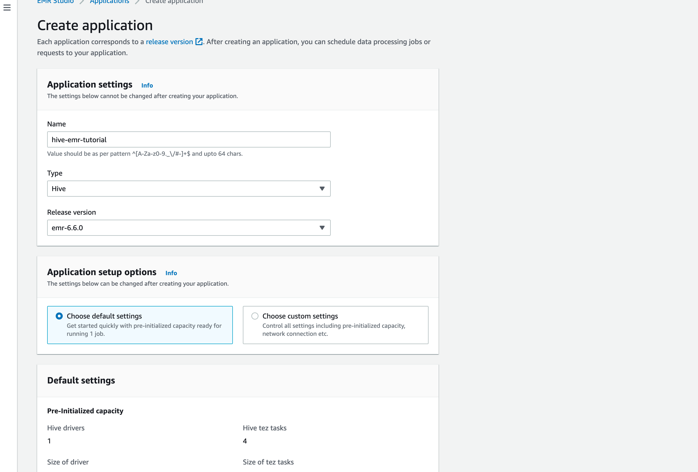

19. Open hive application 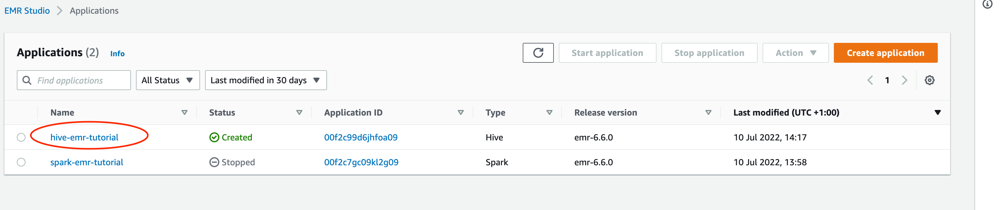

20. Submit the job 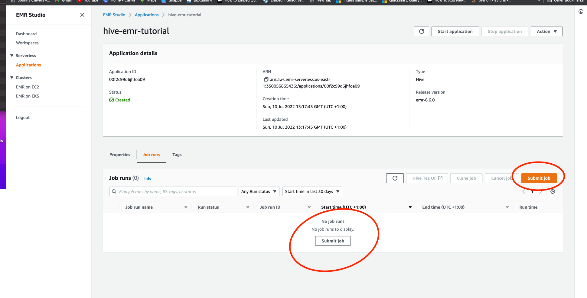

21. Name the hive job, select hive script (change bucket name in script),and select service role. 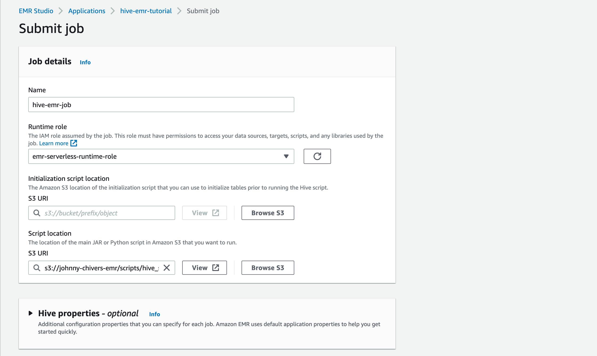

22. Copy and paste Hive config (change bucket name in json). 

23. Submit Job and monintor. Job status will go from pending -> running -> success. 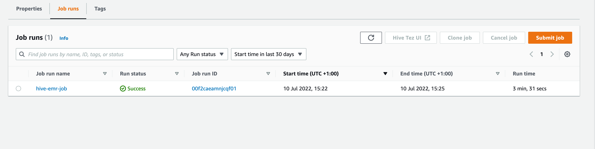

24. Navigate to Glue databases and click emrdb 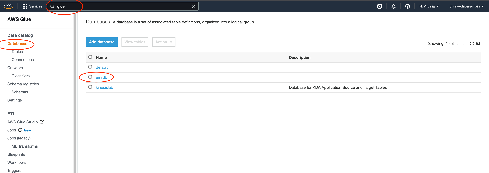

25. Look at table created 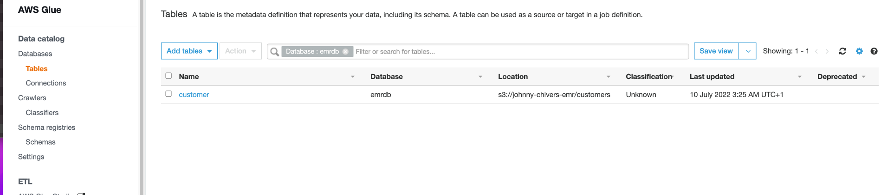

26. Bonus - select data using athena and the created table. 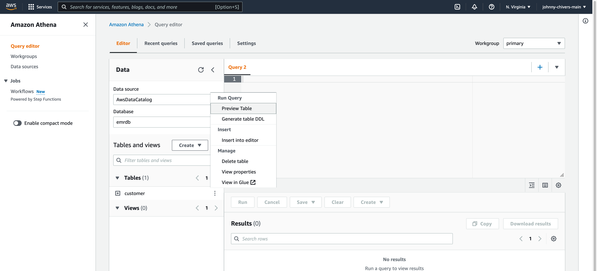

## Creators

**Johnny Chivers**

- <https://github.com/johnny-chivers/>

## Useful Links

- youtube video (link)
- [website](www.johnnychivers.co.uk)
- [buy me a coffee](https://www.buymeacoffee.com/johnnychivers)

Enjoy :metal:
